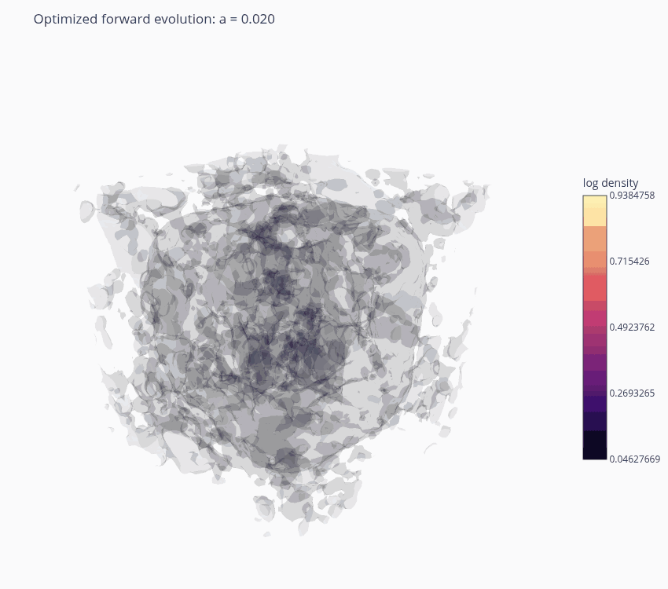

# Disco-DJ Tesseract Demo

This folder contains a Tesseract + Disco-DJ demo.

The notebook
`universe_in_a_container.ipynb`
solves a field-level inverse problem: find Fourier-space white-noise modes
whose evolution under gravity in an expanding universe as computed by Disco-DJ
matches a noisy late-time density target.

The demo target is generated by evolving a standard cosmological noise field
and then embedding a visible tesseract in the late-time density field. See
`generate_late_tesseract_target.py`
for details.



## Setup

This demo is intended for a CUDA-capable GPU with a working JAX GPU setup.

Create and synchronize the environment with `uv`:

```bash
uv venv --python 3.13
uv sync
```

If the local CUDA/JAX setup needs a specific wheel, install the matching JAX GPU
package before running the notebook. The Tesseract runtime-side requirements are
listed in:

```text
tesseract_requirements.txt
```

## Workflow

1. Optionally generate or refresh the target bundle:

   ```bash
   uv run python generate_late_tesseract_target.py --res 64 --noise-sigma 1.0
   ```

   The repository already includes a generated target bundle, so this step is
   not required for a first run.

2. Open `universe_in_a_container.ipynb`.
3. Run the notebook. It builds and serves the Tesseract, performs a forward
   sanity check, and then runs the annealed SciPy L-BFGS reconstruction.

## Files

- `generate_late_tesseract_target.py`:
  target generator script.
- `late_tesseract_target.pdf`:
  preview of the generated target bundle.
- `target_bundle.npz`: single data
  bundle consumed by the notebook.
- `target_geometry.py`: helpers for
  the target generation.
- `tesseract_api.py`:
  differentiable Disco-DJ forward model served by Tesseract.
- `tesseract_config.yaml`:
  Tesseract service configuration for the demo.
- `tesseract_requirements.txt`:
  Python requirements for building and running the Tesseract service.
- `universe_in_a_container.ipynb`:
  main demo notebook.
- `outputs/`: saved optimization
  result and animations.
