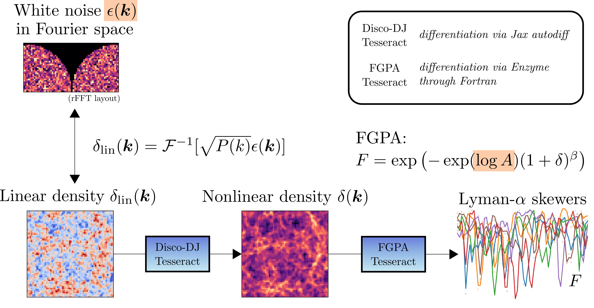
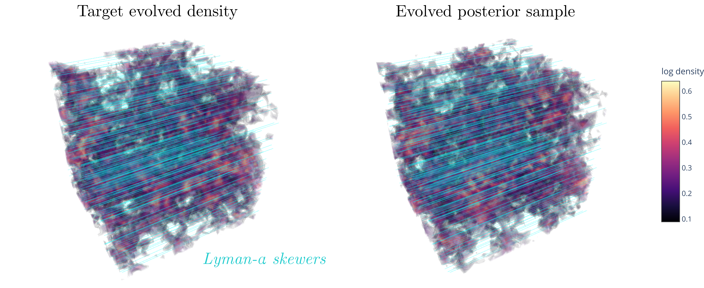
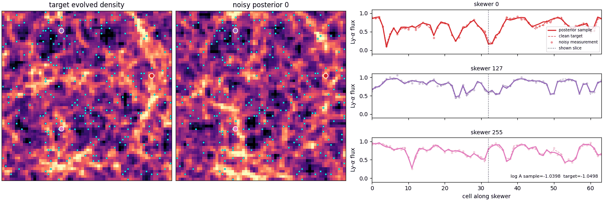

# Lyman-alpha Enzyme Demo



This demo combines Disco-DJ with a Fortran post-processing Tesseract autodifferentiated by Enzyme.
The notebook maps a Fourier-space white-noise field to a linear density field using
Disco-DJ's built-in Eisenstein-Hu linear power spectrum, then evolves that linear density
field with a Disco-DJ Tesseract via the Zel'dovich approximation. The FGPA Tesseract turns the density into 256 random
1D Lyman-alpha transmitted-flux skewers according to the mapping

```text
F = exp(-exp(log_A) * (1 + delta)**beta),
```
known as the *Fluctuating Gunn-Peterson approximation (FGPA)*,  where `delta` is the evolved density contrast (such that `rho = 1 + delta`), `log_A` and `beta` are global parameters, and `F` is the transmitted flux.
From the noisy skewers, the notebook infers the white-noise field and one global FGPA parameter, `log_A`, while
keeping `beta` fixed. It first uses L-BFGS to enter the correct basin from a deliberately
wrong `A = 0.8` (`log_A = -0.223144`), then runs adapted-diagonal HMC to sample the posterior.
The default setup is a `64^3` target with flux-noise standard deviation `0.03` and a true value of `A = 0.35` (`log_A = -1.0498`).




## Files

- `generate_fgpa_loga_target.py`: creates `target_bundle.npz` and `fgpa_loga_target.pdf`.
- `field_level_fgpa_loga_demo.ipynb`: main demo notebook.
- `discodj-forward-external-ics-tesseract/`: Disco-DJ external-IC forward Tesseract.
- `fgpa_skewer_tesseract/`: Fortran FGPA skewer Tesseract and Enzyme build files.
- `targets/`: generated target bundles and previews; git-ignored.
- `outputs/`: notebook-generated MAP/HMC caches, figures, and GIFs; git-ignored.

## Generate the target

```bash
uv run python discodj_tesseract_example/enzyme_fgpa_loga/generate_fgpa_loga_target.py \
    --target-tag target_res_64_std_0p03_noisy
```

For a quick smoke test, use a separate tag and smaller problem:

```bash
uv run python discodj_tesseract_example/enzyme_fgpa_loga/generate_fgpa_loga_target.py \
    --target-tag target_res_16_smoke \
    --res 16 \
    --n-skewers 48
```

## Run the notebook

Open:

```text
discodj_tesseract_example/enzyme_fgpa_loga/field_level_fgpa_loga_demo.ipynb
```

The notebook currently selects `TARGET_TAG = "target_res_64_std_0p03_noisy"` and
`RUN_TAG = "run_res_64_std_0p03_noisy_10_steps_final"`. MAP and HMC caches are written
under `outputs/<RUN_TAG>/`, including periodic HMC checkpoints that allow restarting after
an interrupted run.
